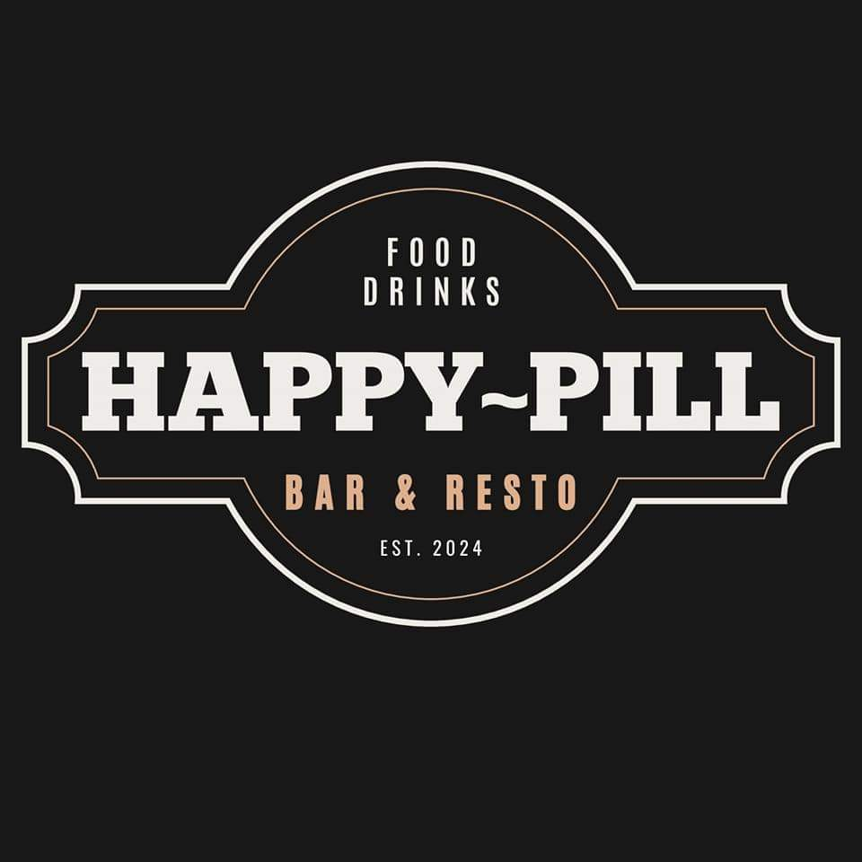

# Happy-Pill Bar & Resto Website

Modern, responsive website for **Happy-Pill Bar & Resto** — a vibrant bar and restaurant in Iloilo City that serves as your daily dose of happiness through crafted cocktails, gourmet bites, live music, and good vibes.

## ✨ Features

- Beautiful hero section with overlay and smooth scroll to features
- Responsive showcase of core offerings (Cocktails • Food • Events)
- Interactive menu browsing with item selection/highlight
- Mobile-first design with Tailwind CSS
- Smooth animations & hover effects
- Story/About section with emotional brand narrative
- Gallery section (Christmas/New Year, events, interior shots)
- Clean component architecture (React + Vite)

## 🛠️ Tech Stack

- **Frontend Framework**: React (Vite)
- **Styling**: Tailwind CSS
- **Routing**: React Router DOM
- **Icons/Images**: SVG + optimized JPG/PNG
- **Deployment Ready**: Netlify / Vercel / GitHub Pages compatible

## 📁 Project Structure
